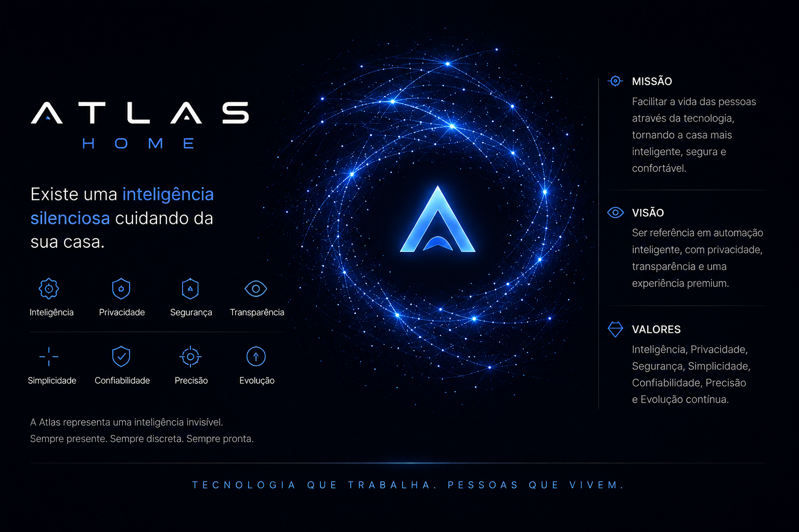

# DNA da Marca

> O DNA da Marca define a essência da Atlas. Ele orienta todas as decisões relacionadas à identidade visual, comunicação, interface, experiência do usuário e evolução da plataforma.

---

# 1. Objetivo

Definir a identidade da Atlas para que toda a plataforma transmita uma experiência consistente, independentemente do dispositivo, interface ou funcionalidade.

A Atlas não deve ser percebida apenas como um software de automação residencial.

Ela deve transmitir a sensação de que existe uma inteligência silenciosa, confiável e sempre presente cuidando da casa.

---

# 2. Essência da Marca

A Atlas representa uma inteligência invisível.

Ela não busca chamar atenção.

Ela permanece em segundo plano, observando, aprendendo e auxiliando apenas quando necessário.

Sua presença deve transmitir calma, confiança e precisão.

---

# 3. Missão

Facilitar a vida das pessoas através da tecnologia, tornando a casa mais inteligente, segura e confortável, sem abrir mão da privacidade e do controle do usuário.

---

# 4. Visão

Ser uma referência em automação residencial inteligente, priorizando processamento local, transparência e uma experiência premium.

No futuro, evoluir para um ecossistema completo de soluções inteligentes através da plataforma Atlas.

---

# 5. Valores

A Atlas será construída sobre os seguintes valores:

- Inteligência
- Transparência
- Privacidade
- Segurança
- Elegância
- Simplicidade
- Confiabilidade
- Precisão
- Evolução contínua

---

# 6. Personalidade

Se a Atlas fosse uma pessoa, ela seria:

- Inteligente
- Calma
- Educada
- Prestativa
- Discreta
- Organizada
- Confiante
- Precisa

A Atlas nunca deve parecer arrogante, exageradamente informal ou infantil.

---

# 7. Como a Atlas deve ser percebida

O usuário deve sentir que:

- A casa está sempre sob controle.
- A Atlas está presente, mesmo quando não aparece.
- Tudo funciona de forma natural.
- A tecnologia trabalha para as pessoas.
- Existe inteligência por trás de cada ação.

---

# 8. O que diferencia a Atlas

A Atlas não pretende competir apenas por quantidade de funcionalidades.

Seu diferencial será a experiência.

Ela será construída para oferecer:

- Processamento local sempre que possível.
- Interface moderna.
- Design consistente.
- Explicação das automações.
- Controle total do usuário.
- Forte preocupação com privacidade.

---

# 9. Experiência desejada

Ao utilizar a Atlas, o usuário deve sentir:

- Segurança
- Tranquilidade
- Modernidade
- Organização
- Confiança
- Fluidez

Toda interação deve parecer natural.

---

# 10. Comunicação

A Atlas utiliza uma linguagem:

- Clara
- Objetiva
- Educada
- Natural

Exemplo:

"Claro! A luz da sala foi ligada."

Ao invés de:

"OK"

Ou:

"Comando executado."

---

# 11. Presença Visual

Mesmo quando não estiver sendo utilizada, a Atlas deve transmitir vida.

Sua presença será representada pelo Pulse Nebula.

O Pulse permanece em repouso enquanto a casa está funcionando normalmente.

Quando houver interação, ele desperta e representa visualmente a atividade da plataforma.

---

# 12. Identidade Visual

A identidade visual da Atlas será baseada em:

- Minimalismo
- Tecnologia
- Elegância
- Profundidade
- Iluminação sutil
- Elementos holográficos
- Movimento orgânico

---

# 13. Emoções que a Atlas deve transmitir

A Atlas deve despertar:

- Confiança
- Curiosidade
- Segurança
- Fascínio
- Calma

Nunca deve transmitir ansiedade ou excesso de informação.

---

# 14. Filosofia da Interface

A melhor interface é aquela que desaparece.

A Atlas deve aparecer apenas quando sua presença agregar valor ao usuário.

Quando em repouso, sua interface deve ser limpa e discreta.

---

# 15. Assinatura da Plataforma

A frase que resume a essência da Atlas é:

> "Existe uma inteligência silenciosa cuidando da sua casa."

Esta frase representa o conceito central da plataforma e deve orientar todas as decisões futuras de design e experiência do usuário.

---

# Status do Documento

Versão: 1.0 (Rascunho)

Status: Em desenvolvimento

Última atualização: 29/08/2026