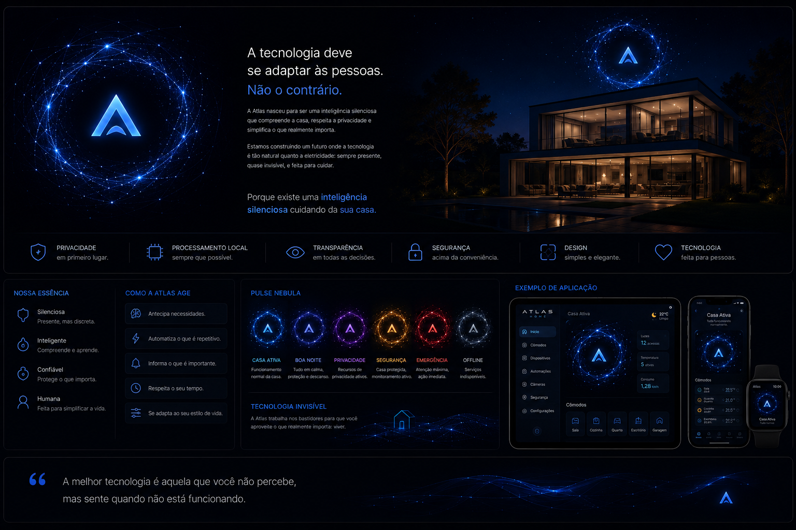

# Manifesto Atlas

> Existe uma inteligência silenciosa cuidando da sua casa.

---

## A tecnologia evoluiu.

Hoje podemos acender luzes com a voz.

Abrir portas pelo celular.

Controlar a temperatura sem sair do sofá.

Mas, muitas vezes, a tecnologia ainda exige que as pessoas se adaptem a ela.

Nós acreditamos no contrário.

A tecnologia deve se adaptar às pessoas.

---

## A Atlas nasceu com esse propósito.

Não queremos criar apenas mais um sistema de automação residencial.

Queremos criar uma plataforma que compreenda a casa.

Que respeite a privacidade.

Que seja transparente.

Que esteja presente apenas quando realmente necessária.

Uma inteligência que trabalha silenciosamente para tornar a vida mais simples.

---

## Inteligência não significa complexidade.

Uma casa inteligente não deve ser difícil de usar.

Ela deve parecer natural.

As automações devem acontecer no momento certo.

As informações devem aparecer apenas quando forem úteis.

A tecnologia deve desaparecer para que a experiência permaneça.

---

## Privacidade não é um recurso.

É um princípio.

A Atlas foi concebida para funcionar localmente sempre que possível.

Os dados pertencem ao usuário.

Sempre será possível entender:

- quais informações estão sendo utilizadas;
- quais permanecem dentro da residência;
- quando algum dado sair da rede local;
- por qual motivo isso aconteceu.

Nenhuma decisão importante será tomada escondida do usuário.

---

## Segurança é construída em camadas.

Uma casa inteligente também deve ser uma casa segura.

Por isso, ações críticas exigirão múltiplas validações.

A Atlas nunca abrirá mão da segurança em nome da conveniência.

---

## Inteligência Artificial existe para ajudar.

Não para substituir as pessoas.

A IA interpreta.

Explica.

Sugere.

Conversa.

Mas o controle continua sendo do usuário.

Sempre.

---

## O futuro começa pela base.

A Atlas Home é apenas o primeiro passo.

Estamos construindo uma plataforma capaz de evoluir.

Novos dispositivos.

Novas tecnologias.

Novas plataformas.

Tudo compartilhando os mesmos princípios.

Porque acreditamos que uma boa arquitetura é aquela que continua fazendo sentido muitos anos depois de ter sido criada.

---

## Nossa visão

Queremos que, um dia, a tecnologia da casa seja tão natural quanto a eletricidade.

Sempre presente.

Sempre disponível.

Quase invisível.

---

## Nosso compromisso

Construiremos a Atlas seguindo alguns princípios que nunca serão negociáveis:

- Privacidade em primeiro lugar.
- Processamento local sempre que possível.
- Transparência em todas as decisões.
- Segurança acima da conveniência.
- Design simples e elegante.
- Tecnologia feita para pessoas.

---

## Atlas

Não é apenas uma plataforma.

É a ideia de que existe uma inteligência silenciosa cuidando da sua casa.