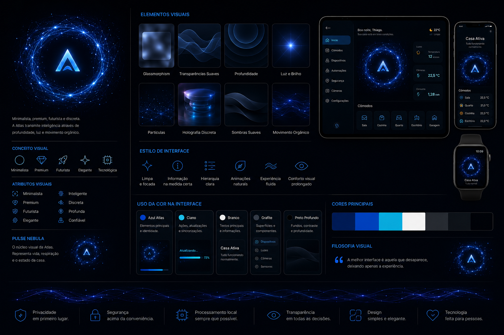

# Identidade Visual

> Este documento define a identidade visual da Atlas Home e estabelece os princípios que deverão orientar toda a experiência visual da plataforma.

---

# 1. Objetivo

A identidade visual da Atlas tem como objetivo transmitir tecnologia, inteligência e confiança sem recorrer a excessos visuais.

Cada elemento da interface deve reforçar a sensação de que existe uma inteligência silenciosa cuidando da residência.

---

# 2. Conceito

A Atlas não deve parecer apenas um software.

Ela deve transmitir a sensação de um sistema vivo.

Sempre presente.

Sempre atento.

Sempre discreto.

A tecnologia deve permanecer em segundo plano enquanto o usuário permanece no centro da experiência.

---

# 3. Personalidade Visual

A Atlas deve transmitir os seguintes atributos:

- Minimalista
- Premium
- Futurista
- Tecnológica
- Elegante
- Inteligente
- Precisa
- Confiável
- Discreta
- Moderna

Esses atributos deverão servir como referência para todas as decisões relacionadas ao design da plataforma.

---

# 4. Sensação Desejada

Ao utilizar a Atlas, o usuário deve sentir:

- tranquilidade;
- segurança;
- organização;
- controle;
- modernidade;
- sofisticação.

A plataforma nunca deve parecer agressiva, infantil ou excessivamente chamativa.

---

# 5. Linguagem Visual

A Atlas utilizará uma linguagem visual baseada em:

- interfaces limpas;
- poucos elementos por tela;
- hierarquia clara das informações;
- iluminação suave;
- transparências discretas;
- profundidade;
- animações orgânicas.

---

# 6. Estilo

A identidade visual da Atlas será baseada nos seguintes conceitos:

## Minimalismo

A interface deve apresentar apenas as informações necessárias.

Elementos desnecessários devem ser evitados.

---

## Premium

Os detalhes devem transmitir qualidade.

Espaçamento, animações, tipografia e cores devem refletir um produto de alto padrão.

---

## Futurismo

A Atlas representa uma tecnologia avançada.

O design deve sugerir inovação sem recorrer a exageros ou clichês.

---

## Tecnologia Invisível

A melhor tecnologia é aquela que trabalha silenciosamente.

A interface deve aparecer apenas quando agregar valor ao usuário.

---

# 7. Materiais

A identidade visual utilizará como referência:

- vidro fosco (Glassmorphism);
- transparências suaves;
- profundidade;
- brilho controlado;
- efeitos holográficos discretos;
- sombras suaves.

---

# 8. Movimento

Toda animação deverá transmitir naturalidade.

As animações devem ser:

- fluidas;
- suaves;
- contínuas;
- orgânicas.

Movimentos bruscos deverão ser evitados.

---

# 9. Pulse Nebula

O Pulse Nebula será o principal elemento visual da Atlas.

Ele representa visualmente o Atlas Core.

Sua função será indicar o estado da plataforma e responder às interações do usuário.

O Pulse Nebula possui documentação própria.

---

# 10. Consistência

Toda interface da Atlas deverá seguir os mesmos princípios visuais.

Isso inclui:

- Dashboard
- Aplicativo
- Tablets
- Atlas Node
- Atlas Mobile
- Portal Web
- Documentação
- Materiais institucionais

---

# 11. O que evitar

A Atlas não deverá utilizar:

- excesso de cores;
- efeitos chamativos;
- animações rápidas;
- excesso de brilho;
- elementos visuais infantis;
- excesso de informação.

A experiência deve permanecer limpa, elegante e confortável.

---

# Status do Documento

Versão: 1.0 (Rascunho)

Status: Em desenvolvimento

Última atualização: 29/08/2026