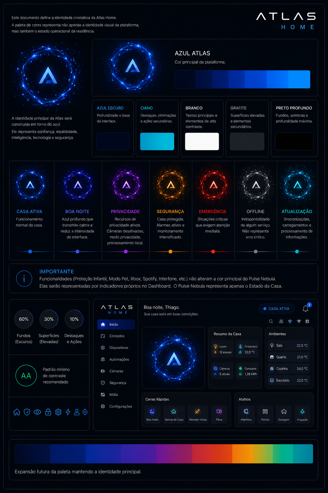

# Paleta de Cores

> Este documento define a identidade cromática da Atlas Home.

A paleta de cores representa não apenas a identidade visual da plataforma, mas também o estado operacional da residência.

---

# 1. Objetivo

As cores da Atlas possuem três funções principais:

- representar a identidade da plataforma;
- comunicar o estado da casa;
- orientar a atenção do usuário.

As cores nunca deverão ser utilizadas apenas por estética.

Cada cor possui um significado.

---

# 2. Conceito

A Atlas utiliza uma identidade baseada em tecnologia, profundidade e tranquilidade.

A plataforma evita cores extremamente saturadas e contrastes agressivos.

O objetivo é transmitir calma, precisão e inteligência.

---

# 3. Cor Principal

A identidade principal da Atlas será construída em torno do azul.

O azul representa:

- confiança;
- estabilidade;
- inteligência;
- tecnologia;
- segurança.

Esta será a cor predominante da plataforma.

---

# 4. Cores Secundárias

Além da cor principal, a Atlas utilizará:

- Azul Escuro
- Ciano
- Branco
- Grafite
- Preto Profundo

Essas cores serão utilizadas para criar profundidade e contraste.

---

# 5. Estados da Casa

O Pulse Nebula será responsável por representar visualmente o estado atual da residência.

## 🟦 Casa Ativa

Cor principal da Atlas.

Representa funcionamento normal.

---

## 🌙 Boa Noite

Azul profundo.

Transmite calma.

Reduz a intensidade luminosa da interface.

---

## 🟣 Privacidade

Roxo.

Representa que recursos relacionados à privacidade estão ativos.

Exemplos:

- câmeras desativadas;
- modo privacidade;
- processamento totalmente local.

---

## 🟠 Segurança

Laranja.

Indica que a residência está protegida.

Exemplo:

- todos saíram de casa;
- alarmes ativos;
- monitoramento intensificado.

---

## 🔴 Emergência

Vermelho.

Representa situações críticas.

Exemplos:

- incêndio;
- vazamento de gás;
- invasão.

Toda a interface adapta-se para facilitar a tomada de decisão.

---

## ⚪ Offline

Cinza.

Indica indisponibilidade de algum serviço.

Não representa erro crítico.

---

## 🔷 Atualização

Ciano.

Representa sincronizações, carregamentos e processamento de informações.

---

# 6. Funcionalidades

Funcionalidades não alteram a cor principal do Pulse Nebula.

Exemplos:

- Proteção Infantil
- Modo Pet
- Xbox
- Spotify
- Interfone

Essas funcionalidades serão representadas por indicadores próprios no Dashboard.

O Pulse Nebula continuará representando apenas o Estado da Casa.

---

# 7. Interface

A interface utilizará predominantemente tons escuros.

Os elementos coloridos serão utilizados apenas para destacar informações relevantes.

O fundo da plataforma deverá permanecer discreto para valorizar o Pulse Nebula.

---

# 8. Contraste

Toda combinação de cores deverá priorizar:

- conforto visual;
- leitura;
- acessibilidade;
- uso prolongado.

---

# 9. Evolução

A paleta poderá receber novas cores futuramente.

Entretanto, a identidade principal baseada no azul deverá permanecer.

---

# Status do Documento

Versão: 1.0 (Rascunho)

Status: Em desenvolvimento

Última atualização: 29/08/2026