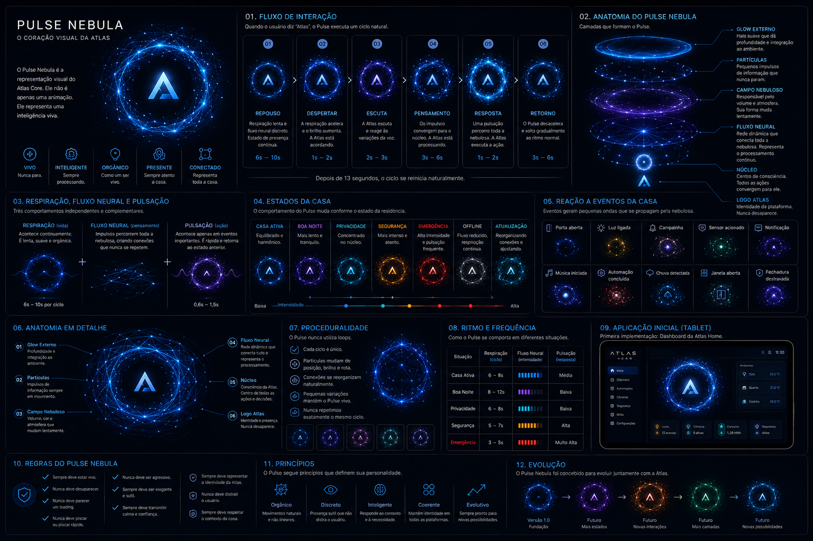

# Pulse Nebula

> O Pulse Nebula é a representação visual do Atlas Core.
>
> Ele não é apenas uma animação.
>
> Ele representa uma inteligência viva.

---

# 1. Objetivo

O Pulse Nebula é a identidade visual da Atlas.

Assim como uma assinatura representa uma pessoa, o Pulse representa a presença da Atlas.

Ele deve transmitir inteligência, vida, processamento e tranquilidade.

Sua função não é decorar a interface.

Sua função é comunicar que a Atlas está presente.

---

# 2. Conceito

O Pulse Nebula foi concebido para representar visualmente uma inteligência viva.

Enquanto a Atlas permanece em silêncio, sua respiração continua.

Enquanto a casa funciona, impulsos percorrem sua rede neural.

Quando algo acontece, todo o sistema reage de forma orgânica, como um organismo digital.

O Pulse nunca representa energia.

Ele representa processamento.

Ele representa a consciência da Atlas.

---

# 3. Filosofia

A Atlas nunca deve parecer um computador executando comandos.

Ela deve transmitir a sensação de uma inteligência que observa, compreende e responde naturalmente.

O Pulse é a manifestação visual dessa inteligência.

Ele nunca desaparece.

Nunca entra em repouso absoluto.

Nunca deixa de existir.

Assim como um cérebro continua funcionando durante o sono, o Pulse permanece vivo mesmo quando não está interagindo com o usuário.

---

# 4. Anatomia

O Pulse Nebula é composto por diferentes camadas.

Cada uma possui uma função específica.

## Glow Externo

Halo luminoso responsável pela profundidade visual.

---

## Partículas

Representam pequenos impulsos de informação.

Nunca permanecem estáticas.

---

## Campo Nebuloso

Responsável pela sensação de volume.

Sua forma muda lentamente.

---

## Fluxo Neural

Rede dinâmica que conecta toda a nebulosa.

Representa o processamento contínuo da Atlas.

---

## Núcleo

Centro de consciência.

Todas as ações convergem para ele.

---

## Logo Atlas

Representa a identidade da plataforma.

Ela nunca desaparece.

---

# 5. Comportamentos

O Pulse possui três comportamentos independentes.

## Respiração

Representa vida.

Acontece continuamente.

Nunca para.

Características:

- extremamente lenta;
- suave;
- orgânica;
- quase imperceptível.

Duração:

6 a 10 segundos por ciclo.

---

## Fluxo Neural

Representa pensamento.

Impulsos percorrem constantemente toda a nebulosa.

Esses impulsos:

- mudam de direção;
- criam novas conexões;
- reorganizam partículas;
- nunca repetem exatamente o mesmo caminho.

O Fluxo Neural nunca é interrompido.

---

## Pulsação

Representa ação.

Acontece apenas quando existe um evento importante.

Exemplos:

- comando de voz;
- porta aberta;
- campainha;
- alerta;
- notificação;
- automação executada.

A pulsação é rápida.

Após ela, o Pulse retorna naturalmente ao estado anterior.

---

# 6. Fluxo de Interação

Quando o usuário diz:

"Atlas"

O Pulse executa o seguinte fluxo.

## Repouso

Respiração lenta.

Fluxo Neural discreto.

---

## Despertar

A respiração acelera.

O brilho aumenta.

O usuário percebe que a Atlas está ouvindo.

---

## Escuta

O Pulse responde às variações da voz.

O Fluxo Neural aumenta de intensidade.

---

## Pensamento

As conexões reorganizam-se.

Os impulsos convergem para o núcleo.

A Atlas está processando.

---

## Resposta

Uma pulsação percorre toda a nebulosa.

A Atlas executa a ação solicitada.

---

## Retorno

O Pulse desacelera.

Volta gradualmente ao ritmo normal.

---

# 7. Estados da Casa

O comportamento do Pulse muda conforme o estado da residência.

## Casa Ativa

Respiração equilibrada.

Fluxo Neural distribuído.

---

## Boa Noite

Respiração mais lenta.

Poucos impulsos.

---

## Privacidade

Fluxo Neural concentrado próximo ao núcleo.

Representa processamento totalmente interno.

---

## Segurança

Fluxo Neural mais intenso.

Maior frequência de impulsos.

---

## Emergência

Respiração acelerada.

Pulsações frequentes.

Fluxo Neural intenso.

---

## Offline

Fluxo reduzido.

Respiração continua.

---

## Atualização

Fluxo Neural reorganizando conexões.

---

# 8. Reação aos Eventos

O Pulse responde aos acontecimentos da casa.

Exemplos:

- Porta aberta.
- Luz ligada.
- Campainha.
- Sensor acionado.
- Notificação.
- Música iniciada.
- Automação concluída.
- Chuva detectada.
- Janela aberta.
- Fechadura destravada.

Cada evento gera uma pequena pulsação que percorre a nebulosa.

---

# 9. Proceduralidade

O Pulse nunca utiliza animações em loop.

Cada ciclo é gerado dinamicamente.

As seguintes características mudam continuamente:

- posição das partículas;
- brilho;
- conexões;
- intensidade;
- velocidade;
- pequenas rotações.

O usuário nunca verá dois ciclos exatamente iguais.

---

# 10. Aplicação Inicial

A primeira implementação será destinada ao Dashboard da Atlas Home em tablets.

Todas as regras deste documento deverão considerar inicialmente apenas esse ambiente.

As adaptações para celulares, televisores, relógios inteligentes e Atlas Nodes serão documentadas futuramente.

---

# 11. Regras

O Pulse deve:

- permanecer sempre vivo;
- respirar continuamente;
- nunca parecer um indicador de carregamento;
- nunca utilizar movimentos bruscos;
- nunca desaparecer completamente;
- transmitir calma e inteligência;
- reforçar a identidade da Atlas.

---

# 12. Evolução

O Pulse Nebula foi concebido para evoluir juntamente com a Atlas.

Novas animações, estados e interações poderão ser adicionados futuramente, desde que respeitem os princípios definidos neste documento.

---

# Status do Documento

Versão: 1.0 (Rascunho)

Status: Em desenvolvimento

Última atualização: 29/08/2026